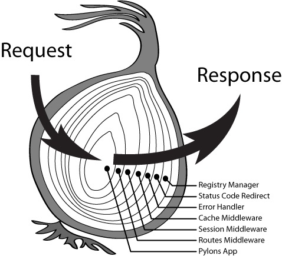

# TS AOP

## AOP Overview

Aspect Oriented Programming (AOP), Chinese meaning is "面向切面编程". We can separate parts of business 
logic with AOP to reduce coupling of them.

Let's image a very common situation, beside execute necessary automated operations, we also need to do 
something like logging, save screenshot when we use selenium-webdriver to do web automated testing. It is obvious that these operations is not strongly related with business logic, but we sure need them. Now the situation is that we need these functions but we no hope to include these code explicitly in modeling stage. So we want a new way to reslove it.

For example, we want to recode time consuming and take a screenshot after every step in web automated testing. The simplest way is to put the code which record time consuming and take a screenshot in every step. But disadvantages of this approach is if we have many step, things will become uncontrollable. It's 
impossible to maintain thousands of steps which there are lots of similar code in every step.

AOP makes it possible to resolve this problem elegantly.


## AOP vs OOP

OOP即面向对象编程，这个大家再熟悉不过。当面对一份需求时，我们一般会先将需求中的领域模型分析出来，再针对这些领域模型建模，每种领域模型有它们自己的属性和方法。在OOP领域，我们可以利用接口、继承、多态等抽象机制以及一系列相关的设计模式来实现我们的需求。

很容易发现，OOP实际上是针对静态内容的建模，或者说是针对名词的建模。例如创建一个Employee类，这个类有name, age, title, department等实例属性，也有work, takeABreak等实例方法。实例属性描述对象实例固有的一些特征，实例方法描述对象实例可以执行的操作。基于此，我们可以写出

```
Employee employee = new Employee(...);
employee.work();
employee.takeABreak();
```

这样描述性很强的方法。上面代码中调用的方法都是和Employee类强关联的，这些强关联的方法组成业务逻辑。毋庸置疑，OOP在写业务逻辑（也就是描述事物）方面具有很大的优势。

但是在实际编程中，我们可能想要有更“动态”一些的东西，比如我们希望在用户执行一个敏感操作时写日志。如果用OOP去实现，我们只能修改这个敏感操作的代码，将写日志这个操作的代码加入进去。如果后来发现有另一个操作也需要这样处理，只能照原样再来一次。这样做当然可以工作，但是却很不优雅。写日志这种操作和业务逻辑是没有关系的，但是还是要修改业务逻辑的代码。如果用AOP的方式去处理，我们可以在具体操作执行前后各暴露出一个切面，在这些切面上动态地“织入”这些辅助代码。也就是说，AOP是面向动作（动词）的。有了OOP和AOP的合作，我们的代码会变得更优雅，更有可扩展性。

举一个最简单的AOP的例子：函数包装。假设我们有一个函数op，我们需要再其执行前后都写日志:

```
let op = () => {
  console.log('executing op...');
};

let oriOp = op;

op = () => {
  console.log('before op...');
  oriOp();
  console.log('after op...');
}
```

这里我们并没有直接修改op代码本身，而是对其进行了包装，首先保存op的原引用到oriOp，然后创建一个新函数赋值给op，这个新函数在内部调用oriOp（也就是原来的op），而在其前后增加了写日志的操作。这样一来，在不直接修改op原来代码的情况下，我们在op的基础上提供了写日志的功能。

当然实际项目代码中的AOP要比这个例子复杂很多，基本上都会用到编程语言元编程的一些东西，但是基本原理其实和这个例子所展示的类似。值得一提的是，AOP是一种编程概念，而并不是某一种编程语言所特有，大部分编程语言都可以以AOP的方式写代码。


## Solution 1 - Simple Method Hooks

Solution 1 use hooks to wrap original methods to new methods, we put the auxiliary functions in hooks.
See [hook driver](./src/driver/hook.ts)


## Solution 2 - Simple Onion Model

See [onion driver](./src/driver/onion.ts)


## Solution 3 - Advanced Onion Model

See [onion2 driver](./src/driver/onion2.ts)


## AOP Programming in Koa



## Run tests

```shell
npm test
```


## More Informations

- [什么是面向切面编程AOP](https://www.zhihu.com/question/24863332)
- [Koa Web Framework](https://koajs.com/)
- [Object.defineProperty()](https://developer.mozilla.org/en-US/docs/Web/JavaScript/Reference/Global_Objects/Object/defineProperty)